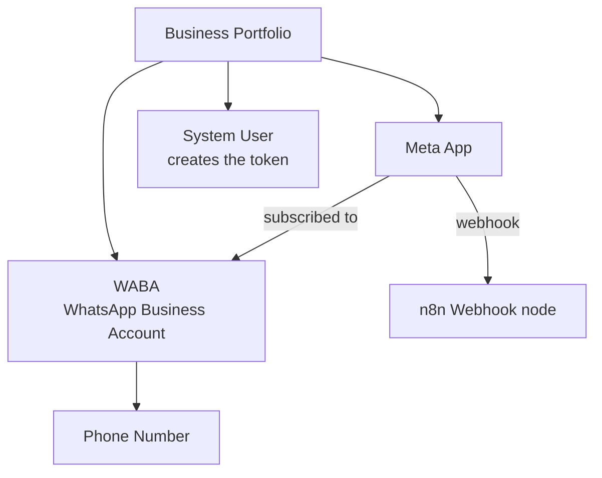

# WhatsApp Cloud API + n8n: Full Setup Guide

Sep 23, 2026 · @Someone

## Overview

This guide connects a WhatsApp number to an n8n workflow using Meta Cloud API, from a new App to a working reply. The phone number lives inside a WABA, and the App must be subscribed to that WABA to receive messages.



The App, the WABA and the System User must all be in the same Business Portfolio.

### Placeholders

Any word in CAPITAL\_LETTERS inside a command is a placeholder. Replace it before running the command.

| Placeholder | What it is | Where to find it |
| --- | --- | --- |
| `APP_ID` | The Meta App ID | App settings → Basic |
| `APP_SECRET` | The App secret (never share) | App settings → Basic → Show |
| `WABA_ID` | WhatsApp Business Account ID | Business Settings → WhatsApp accounts |
| `PHONE_NUMBER_ID` | ID of the phone number (not the number itself) | Step 3 command output |
| `TOKEN` | System User access token (never share) | Step 3 |
| `DOMAIN` | Your n8n domain | Your server |
| `PATH` | Webhook node path | n8n Webhook node |
| `VERIFY_TOKEN` | Any secret word you choose (letters, numbers, `_` only) | You choose it |

## Step 1: Create the App

**Goal:** A Meta App with the WhatsApp use case, inside the same Business Portfolio as the number.

1. `developers.facebook.com` → **My Apps** → **Create App**.
2. Enter an app name and your contact email → **Next**.
3. **Use cases:** choose the one with **WhatsApp** → **Next**.
4. **Business:** choose the portfolio that holds the WABA. Check it, don't accept the default blindly.
5. **Next** until **Create app**.

**Check:** Business Settings → **System users** → any user → **Generate token** → open **Select app**. Your new App must be in the list. Close the window without generating.

**If the App is not in the list:** it was created in another portfolio. Create a new App and pick the right portfolio.

Don't use **Add phone number** in the App dashboard if the number is already Connected in the WABA. Never click **disconnect it from the existing account**.

## Step 2: Give the System User access

**Goal:** The System User can manage the App and the WABA, so its token will work.

1. `business.facebook.com/settings` → **System users** → choose the user.
2. **Assigned assets** → **Assign assets** → **Apps** → your App → **Full control** → **Assign**.
3. **Assign assets** again → **WhatsApp accounts** → your WABA → **Full control** → **Assign**.

**Check:** The **Assigned assets** tab shows both the App and the WABA.

## Step 3: Generate the token and get the Phone Number ID

**Goal:** A permanent token for the App, and the ID of the phone number.

1. **System users** → your user → **Generate token**.
2. **Select app:** your App. **Expiration:** Never.
3. **Permissions:** `whatsapp_business_messaging` and `whatsapp_business_management` → **Generate token**.
4. Copy the token now and save it in a safe place. Meta shows it only once.

**Code: test the token and list the numbers**

```bash
curl "https://graph.facebook.com/v26.0/WABA_ID/phone_numbers?fields=id,display_phone_number,verified_name,status,quality_rating" \
  -H "Authorization: Bearer TOKEN"
```

**Expected:**

```json
{"data":[{"id":"1229900990198063","display_phone_number":"+20 10 05578738","verified_name":"Pixtaha Gym Development","status":"CONNECTED","quality_rating":"GREEN"}]}
```

The `id` here is the `PHONE_NUMBER_ID`. `status` must be `CONNECTED`.

## Step 4: Connect the App to the WABA

**Goal:** Tell Meta to send this WABA's messages to your App. The token decides which App gets connected.

**Code: connect**

```bash
curl -X POST "https://graph.facebook.com/v26.0/WABA_ID/subscribed_apps" \
  -H "Authorization: Bearer TOKEN"
```

**Expected:**

```json
{"success":true}
```

**Code: check**

```bash
curl "https://graph.facebook.com/v26.0/WABA_ID/subscribed_apps" \
  -H "Authorization: Bearer TOKEN"
```

**Expected:** your App name inside `data`.

```json
{"data":[{"whatsapp_business_api_data":{"name":"pixtaha-lecture","id":"1223291870011717"}}]}
```

If you see an App you don't know, remove it. It receives a copy of every message.

## Step 5: Build the n8n workflow

**Goal:** One URL that answers Meta's verification (GET) and receives messages (POST).

1. Create a new workflow, copy the JSON below, click the empty canvas and press `Cmd + V`.
2. **Webhook** node → change **Path** to a unique name. Two active workflows can't share a path.
3. **Check Verify Token** node → change `VERIFY_TOKEN` to your own word.
4. **Save**, then **Activate** (or **Publish** in n8n 2.x).

Don't use the **WhatsApp Trigger** node on the same App. It registers its own webhook and deletes it when deactivated.

**Code: workflow (paste into n8n)**

```json
{
  "nodes": [
    {
      "parameters": {
        "multipleMethods": true,
        "httpMethod": ["GET", "POST"],
        "path": "PATH",
        "responseMode": "responseNode",
        "options": {}
      },
      "name": "Webhook",
      "type": "n8n-nodes-base.webhook",
      "typeVersion": 2,
      "position": [0, 0],
      "webhookId": "7b1e2c4a-9d3f-4a61-b8e2-5c0f1a2d3e4f"
    },
    {
      "parameters": {
        "conditions": {
          "options": { "caseSensitive": true, "leftValue": "", "typeValidation": "loose" },
          "conditions": [
            { "id": "c1", "leftValue": "={{ $json.query['hub.mode'] }}", "rightValue": "subscribe", "operator": { "type": "string", "operation": "equals" } },
            { "id": "c2", "leftValue": "={{ $json.query['hub.verify_token'] }}", "rightValue": "VERIFY_TOKEN", "operator": { "type": "string", "operation": "equals" } }
          ],
          "combinator": "and"
        },
        "options": {}
      },
      "name": "Check Verify Token",
      "type": "n8n-nodes-base.if",
      "typeVersion": 2,
      "position": [240, -100]
    },
    {
      "parameters": {
        "respondWith": "text",
        "responseBody": "={{ $('Webhook').item.json.query['hub.challenge'] }}",
        "options": { "responseCode": 200 }
      },
      "name": "Return Challenge",
      "type": "n8n-nodes-base.respondToWebhook",
      "typeVersion": 1.1,
      "position": [480, -200]
    },
    {
      "parameters": { "respondWith": "noData", "options": { "responseCode": 403 } },
      "name": "Reject",
      "type": "n8n-nodes-base.respondToWebhook",
      "typeVersion": 1.1,
      "position": [480, 0]
    },
    {
      "parameters": { "respondWith": "noData", "options": { "responseCode": 200 } },
      "name": "Ack Message",
      "type": "n8n-nodes-base.respondToWebhook",
      "typeVersion": 1.1,
      "position": [240, 150]
    }
  ],
  "connections": {
    "Webhook": {
      "main": [
        [{ "node": "Check Verify Token", "type": "main", "index": 0 }],
        [{ "node": "Ack Message", "type": "main", "index": 0 }]
      ]
    },
    "Check Verify Token": {
      "main": [
        [{ "node": "Return Challenge", "type": "main", "index": 0 }],
        [{ "node": "Reject", "type": "main", "index": 0 }]
      ]
    }
  }
}
```

| Branch | What it does |
| --- | --- |
| GET → Check Verify Token → Return Challenge | Answers Meta's verification with `hub.challenge` |
| GET → Check Verify Token → Reject | Wrong token → 403 |
| POST → Ack Message | Replies 200 fast so Meta doesn't resend the message |

## Step 6: Test the verification with curl

**Goal:** Pretend to be Meta and check that n8n answers correctly, before touching the Meta dashboard.

**Code:**

```bash
curl -i "https://DOMAIN/webhook/PATH?hub.mode=subscribe&hub.verify_token=VERIFY_TOKEN&hub.challenge=12345"
```

**Expected:** status `200` and the body is exactly `12345`.

```
HTTP/2 200
content-type: text/html; charset=utf-8

12345
```

| Part | Meaning |
| --- | --- |
| `hub.mode=subscribe` | Meta wants to subscribe |
| `hub.verify_token` | Must match the token in **Check Verify Token** |
| `hub.challenge` | n8n must send this value back as it is |

Don't continue to Step 7 until you get `12345`.

## Step 7: Register the webhook in Meta

**Goal:** Tell Meta where to send the App's messages. The API is the source of truth, not the dashboard.

**Option A: Dashboard**

1. App → **Use cases** → **Connect on WhatsApp** → **Customize** → **Step 2. Production setup** → **Configure Webhooks**.
2. **Callback URL:** `https://DOMAIN/webhook/PATH`
3. **Verify token:** `VERIFY_TOKEN`
4. **Verify and save**, then make sure **messages** is **Subscribed** in **Webhook fields**.

**Option B: API (use it if the dashboard fails, or to be sure)**

```bash
curl -X POST "https://graph.facebook.com/v26.0/APP_ID/subscriptions" \
  -d "object=whatsapp_business_account" \
  -d "callback_url=https://DOMAIN/webhook/PATH" \
  -d "verify_token=VERIFY_TOKEN" \
  -d "fields=messages" \
  -d "access_token=APP_ID|APP_SECRET"
```

**Expected:**

```json
{"success":true}
```

This uses the **App token** (`APP_ID|APP_SECRET`), not the System User token.

**Code: always check**

```bash
curl "https://graph.facebook.com/v26.0/APP_ID/subscriptions?access_token=APP_ID|APP_SECRET"
```

**Expected:**

```json
{"data":[{"object":"whatsapp_business_account","callback_url":"https://DOMAIN/webhook/PATH","active":true,"fields":[{"name":"messages","version":"v26.0"}]}]}
```

If it returns `{"data":[]}`, no webhook is registered. Run Option B.

## Step 8: Publish the App

**Goal:** Switch the App to live mode. An unpublished App receives only the dashboard **Test** webhooks, not real messages.

**Quick check before publishing:** In **Webhook fields**, click **Test** next to **messages**. If it reaches n8n, the webhook is fine and publishing is the only missing step.

1. **App settings** → **Basic**.
2. Fill **Privacy policy URL** (a real page that opens) and **Category**.
3. **Save changes**.
4. Left menu → **Publish** → **Publish**.

**Expected:** The label next to **Publish** is no longer **Unpublished**.

## Step 9: Receive a real message and parse it

**Goal:** Confirm real messages arrive, then turn Meta's big JSON into clean fields.

1. Send a WhatsApp message from your phone to the business number.
2. n8n → **Executions**. Open the newest one.

**Expected:** `"user-agent": "facebookexternalua"` and a `messages` array in the body. (`curl/...` means it was your own test, not Meta.)

```json
{
  "body": {
    "object": "whatsapp_business_account",
    "entry": [{
      "changes": [{
        "value": {
          "metadata": { "display_phone_number": "201005578738", "phone_number_id": "1229900990198063" },
          "contacts": [{ "profile": { "name": "Pixtaha" }, "wa_id": "201554445243" }],
          "messages": [{ "from": "201554445243", "id": "wamid.HBgM...", "timestamp": "1790148898", "type": "text", "text": { "body": "Hello" } }]
        },
        "field": "messages"
      }]
    }]
  }
}
```

**Code: Code node `Parse Message` (after Ack Message)**

```javascript
const value = $('Webhook').first().json.body?.entry?.[0]?.changes?.[0]?.value;

// ignore status updates (sent / delivered / read)
if (!value?.messages?.length) {
  return [];
}

const msg = value.messages[0];
const contact = value.contacts?.[0];

return [{
  json: {
    phone_number_id: value.metadata.phone_number_id,
    from: msg.from,
    name: contact?.profile?.name ?? '',
    message_id: msg.id,
    timestamp: Number(msg.timestamp),
    type: msg.type,
    text: msg.type === 'text' ? msg.text.body : null,
    media_id: msg[msg.type]?.id ?? null,
    button_reply: msg.interactive?.button_reply?.id
      ?? msg.interactive?.list_reply?.id
      ?? null,
    button_title: msg.interactive?.button_reply?.title ?? null,
  }
}];
```

**Expected:**

```json
{
  "phone_number_id": "1229900990198063",
  "from": "201554445243",
  "name": "Pixtaha",
  "message_id": "wamid.HBgM...",
  "timestamp": 1790148898,
  "type": "text",
  "text": "Hello",
  "media_id": null,
  "button_reply": null,
  "button_title": null
}
```

**Tip: test without sending every time.** Executions → open a real execution → **Debug in editor**. The real message gets pinned to the Webhook node, and **Execute step** reuses it. Pinned data only affects manual runs.

## Step 10: Reply with buttons (HTTP Request node)

**Goal:** Send an interactive message with up to 3 buttons, from the same number that received the message.

| Setting | Value |
| --- | --- |
| Method | `POST` |
| URL | `https://graph.facebook.com/v26.0/{{ $('Parse Message').item.json.phone_number_id }}/messages` |
| Authentication | Generic Credential Type → Header Auth |
| Header Auth | Name: `Authorization` · Value: `Bearer TOKEN` |
| Send Body | ON · JSON · Using JSON |

Make one credential per App and name it clearly. Never hard-code the Phone Number ID. A duplicated workflow will reply from the wrong number.

**Code: JSON body**

```json
{
  "messaging_product": "whatsapp",
  "recipient_type": "individual",
  "to": "{{ $('Parse Message').item.json.from }}",
  "type": "interactive",
  "interactive": {
    "type": "button",
    "body": { "text": "Welcome! What would you like to do?" },
    "action": {
      "buttons": [
        { "type": "reply", "reply": { "id": "btn_book", "title": "Book" } },
        { "type": "reply", "reply": { "id": "btn_prices", "title": "Prices" } },
        { "type": "reply", "reply": { "id": "btn_support", "title": "Support" } }
      ]
    }
  }
}
```

**Expected (HTTP Request output):**

```json
{"messaging_product":"whatsapp","contacts":[{"input":"201554445243","wa_id":"201554445243"}],"messages":[{"id":"wamid.HBgM..."}]}
```

**Expected (after the user taps a button), Parse Message output:**

```json
{ "type": "interactive", "text": null, "button_reply": "btn_book", "button_title": "Book" }
```

**Rules:** max 3 buttons · `title` max 20 characters · each `id` unique · only within 24 hours of the user's last message.

## Troubleshooting

Find your symptom, then run the check. Most problems come from one of these.

| Symptom | Cause | Fix |
| --- | --- | --- |
| `Object with ID 'WABA_ID' does not exist` | Placeholder not replaced | Put the real ID in the command |
| `missing permissions` with a real ID | Token has no access to the WABA | Step 2: assign the WABA to the System User |
| App not in **Select app** list | App created in another portfolio | Create a new App in the right portfolio |
| `already registered to a WhatsApp account` | Adding a number that is already Connected | Close the window. Don't add or disconnect it |
| `404 ... is not registered` | Workflow not active | Activate / Publish the workflow |
| `400` with no body | Non-English characters in the URL | Use letters, numbers and `_` only |
| `{"message":"Webhook call received"}` | WhatsApp Trigger node answered, not your Webhook node | Stop the WhatsApp Trigger workflow |
| `The callback URL or verify token couldn't be validated` | curl test in Step 6 fails | Fix n8n first, then verify in Meta |
| `GET /APP_ID/subscriptions` returns `{"data":[]}` | No webhook registered | Step 7, Option B |
| Dashboard **Test** works, real messages don't | App unpublished | Step 8 |
| Reply comes from the wrong number | Hard-coded Phone Number ID or old token | Use `phone_number_id` from the message + the right credential |
| Messages stopped after deactivating a workflow | WhatsApp Trigger deleted the webhook | Step 7 again |

**Checks in order when messages don't arrive:**

1. `GET /WABA_ID/phone_numbers` → `status: CONNECTED`
2. `GET /WABA_ID/subscribed_apps` → your App is listed
3. `GET /APP_ID/subscriptions` → right `callback_url`, `messages` in fields
4. Step 6 curl → `12345`
5. App is Published
